# Procesverslag
Markdown is een simpele manier om HTML te schrijven.  
Markdown cheat cheet: [Hulp bij het schrijven van Markdown](https://github.com/adam-p/markdown-here/wiki/Markdown-Cheatsheet).

Nb. De standaardstructuur en de spartaanse opmaak van de README.md zijn helemaal prima. Het gaat om de inhoud van je procesverslag. Besteedt de tijd voor pracht en praal aan je website.

Nb. Door *open* toe te voegen aan een *details* element kun je deze standaard open zetten. Fijn om dat steeds voor de relevante stuk(ken) te doen.

## Jij

uitwerken voor kick-off werkgroep

### Auteur:
Arsenio Jardim

#### Je startniveau:
blauw

#### Je focus:
responsive plane (misschien allebei)
 

## Je website

uitwerken voor kick-off werkgroep

### Je opdracht:
https://jeugdjournaal.nl/

#### Screenshot(s) van de eerste pagina (small screen): 
Jeugdjournaal homepage 
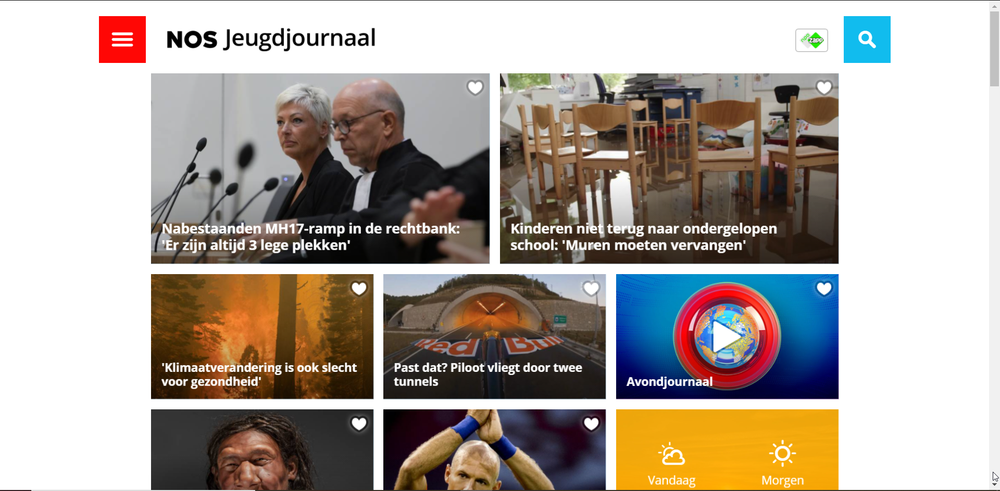

#### Screenshot(s) van de tweede pagina (small screen):
hier de naam van de pagina  
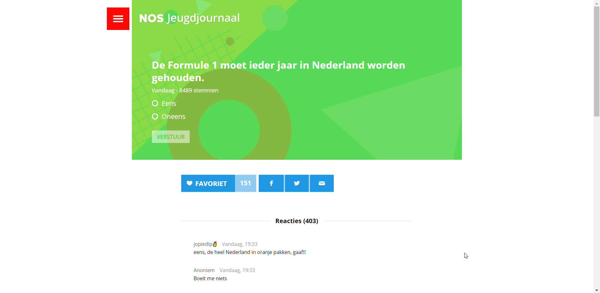
 

## Breakdownschets (week 1)

uitwerken na afloop 2e werkgroep

### de hele pagina: 
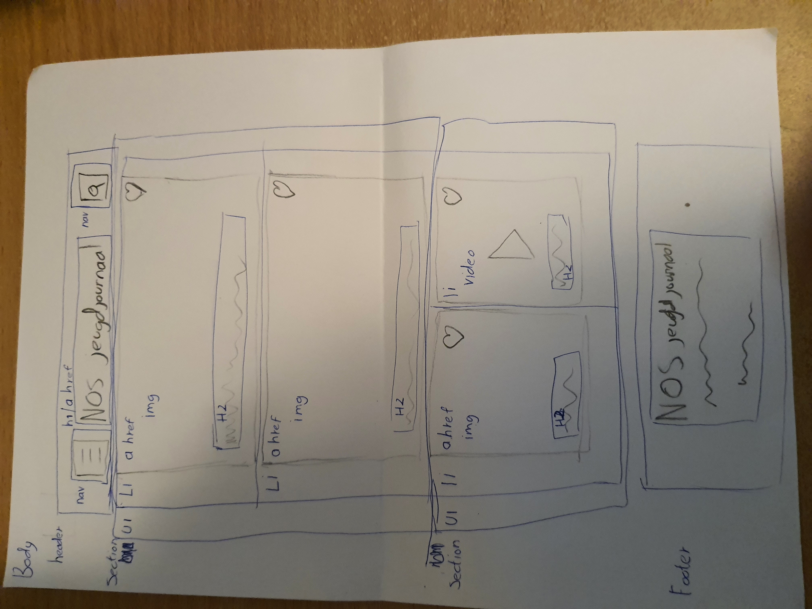

### dynamisch deel (bijv menu): 

### wellicht nog een dynamisch deel (bijv filter): 

## Voortgang 1 (week 2)

uitwerken voor 1e voortgang

### Stand van zaken
hier dit ging goed & dit was lastig (neem ook screenshots op van delen van je website en code)

Op een desktop begint de vormgeving wel een beetje op die van het Jeugdjournaal te lijken
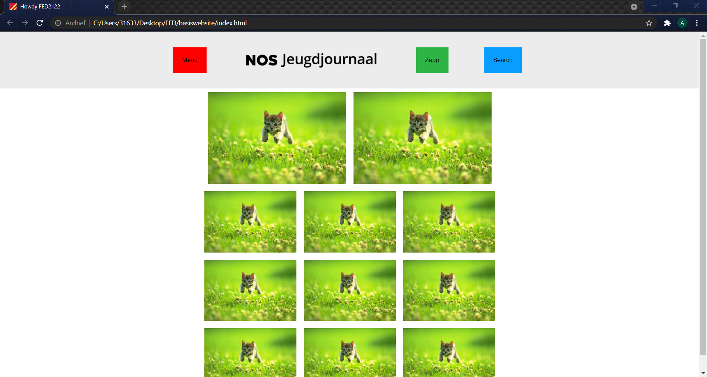

Helaas lukt het mij nog niet echt om de website responsive te maken voor een mobiele one-pager. Het werken met units vind ik over het algemeen enorm lastig en flexbox moet ik ook nog zien uit te vogelen.
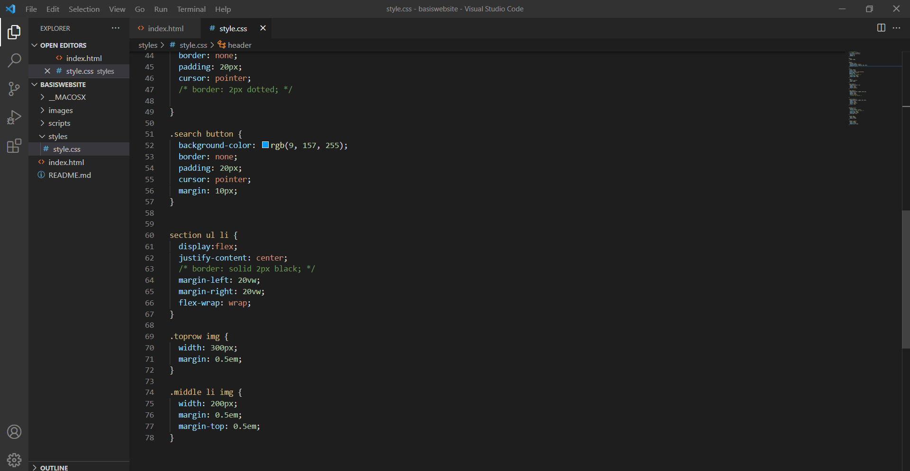

### Agenda voor meeting
samen met je groepje opstellen

| student 1      | student 2          | student 3    | student 4        |
| ---            | ---                | ---          | ---              |
| dit bespreken  | en dit             | en ik dit    | en dan ik dat    |
| en dat ook nog | dit als er tijd is | nog een punt | dit wil ik zeker |
| ...            | ...                | ...          | ...              |

### Verslag van meeting
hier na afloop snel de uitkomsten van de meeting vastleggen

- Als ik mijn website responsive wil maken, moet ik responsive units gebruiken zoals vw in plaats van em.
- Ik moet alvast beginnen met het toevoegen van content
- nog een punt
- ...

## Voortgang 2 (week 3)

uitwerken voor 2e voortgang

### Stand van zaken
Mijn website is nu eindelijk responsive, verder is het mij ook gelukt om wat content een hamburgermenu toe te voegen. De opmaak van de CSS en het maken van een tweede page gaat wel een beetje lastig worden denk ik.

### Agenda voor meeting
samen met je groepje opstellen

| student 1      | student 2          | student 3    | student 4        |
| ---            | ---                | ---          | ---              |
| dit bespreken  | en dit             | en ik dit    | en dan ik dat    |
| en dat ook nog | dit als er tijd is | nog een punt | dit wil ik zeker |
| ...            | ...                | ...          | ...              |

### Verslag van meeting
hier na afloop snel de uitkomsten van de meeting vastleggen

- ul li verwijderen voor artikelen
- article ipv section gebruiken, h1 ipv figcaption
- nog een punt
- ...

## Toegankelijkheidstest (week 4)

uitwerken na test in 8e voortgang

### Bevindingen
Lijst met je bevindingen die in de test naar voren kwamen:

#### De screenreader

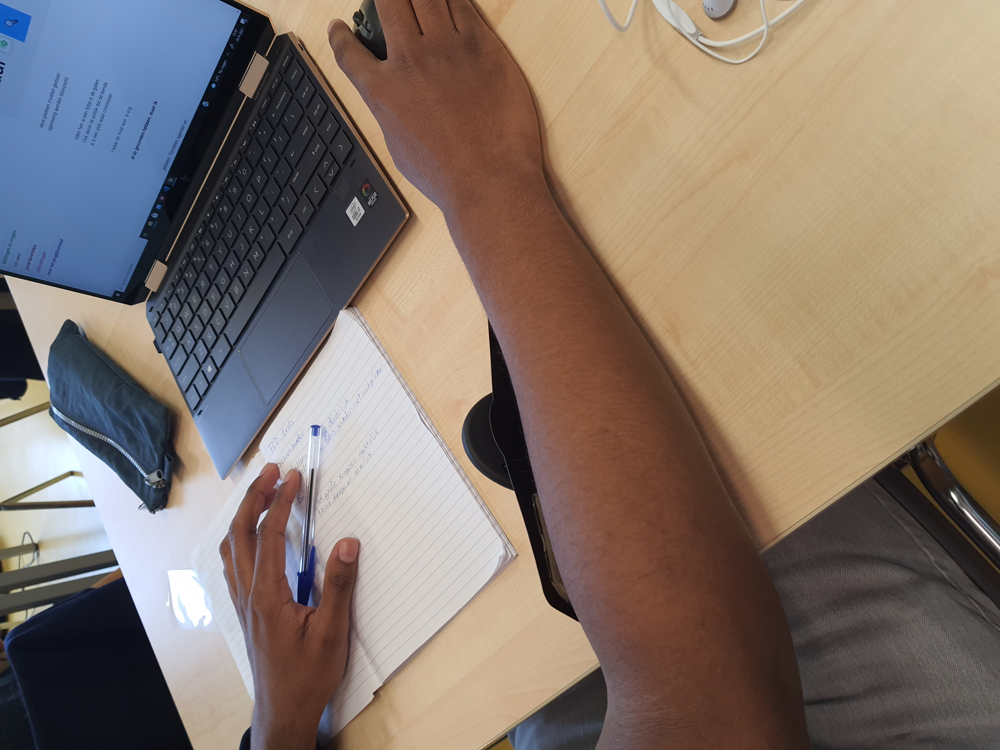
-	buttons zijn niet duidelijk genoeg
-	de titels van de artikelen worden niet voorgelezen
-	de foto's en buttons kunnen niet van elkaar worden onderscheiden

Hoe dit opgelost kan worden: (met indien nodig een afbeelding)
-	img alt gebruiken
-	articles binnen een "a" element te zetten zodat de screenreader hem kan lezen

#### De ballon 

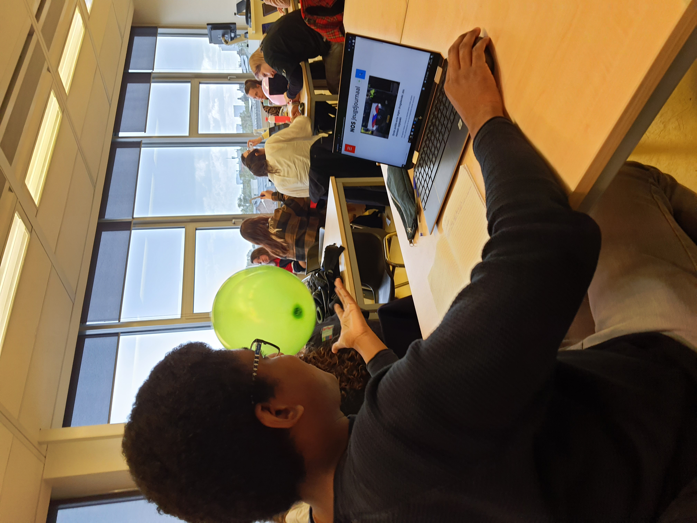
-	het is te moeilijk om de muis te bedienen en tegelijkertijd een ballon omhoog te houden
-	het is lastig om op bepaalde links/knoppen te drukken

Hoe dit opgelost kan worden: (met indien nodig een afbeelding)
-	grote knoppen
-	velle/opvallende kleuren gebruiken

#### Elektrische Stimulator. 

Ik deed een stimulator om mijn arm die mij meerdere schokken gaf en probeerde daarmee mijn website te bedienen.
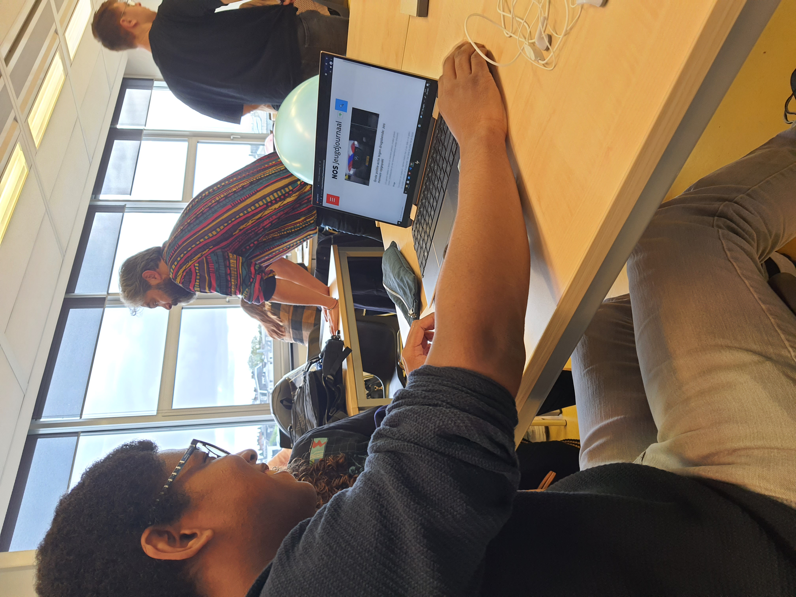
	
-	Het was vrijwel onmogelijk om een muis vast te houden

Hoe dit opgelost kan worden: (met indien nodig een afbeelding)
-	De website toegankelijk maken voor toetsenboorden.
-	knoppen niet te klein maken

#### slechtziende brillen. 
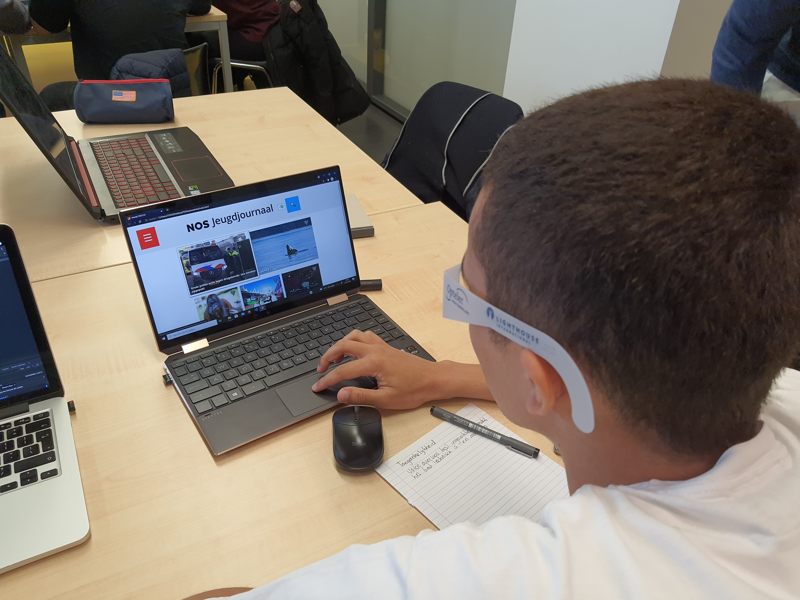
Ik deed meerdere tests met brillen die je blind of kleurenblind maken

-	als je kleurenblind bent en een toetsenboord gebruikt om de website te navigeren, kan het nogal moeilijk zijn om de focus states van bepaalde knoppen te zien

Hoe dit opgelost kan worden:

-	een duidelijke licht/donker contrast gebruiken bij verschillende button states	

## Voortgang 3 (week 4)

uitwerken voor 3e voortgang

### Stand van zaken
Het maken van de tweede pagina ging makkelijker dan ik had gedacht. De website is responsive, maar ik hem nog toegankelijker maken voor toetsenboorden en screenreaders. de fontsize werkt ook niet altijd mee met bepaalde schermgroottes.

### Agenda voor meeting
samen met je groepje opstellen

| student 1      | student 2          | student 3    | student 4        |
| ---            | ---                | ---          | ---              |
| Focus states bespreken  | en dit             | en ik dit    | en dan ik dat    |
| en dat ook nog | dit als er tijd is | nog een punt | dit wil ik zeker |
| ...            | ...                | ...          | ...              |

Ik wil zelf focus states bespreken, wanneer ik voor een tweede keer op een knop druk blijft hij vastzitten in de focus state totdat ik op iets anders klik.
Ik twijfel ook of ik genoeg content heb

### Verslag van meeting
hier na afloop snel de uitkomsten van de meeting vastleggen

- form toevoegen aan mijn tweede pagina
- video player toevoegen
- focus states voor alle links en buttons maken
- quote in mijn artikel stylen

## Eindgesprek (week 5)

uitwerken voor eindgesprek

### Stand van zaken
het toevoegen van een form was veel moeilijker dan ik had verwacht en om heel eerlijk te zijn begrijp ik nog steeds niet helemaal hoe het stylen van een radio button werkt.
Ik kwam er ook niet echt aan toe om een video player toe te voegen.
De website is volledig responsive waar ik enorm blij mee ben.
De "Zapp" logo blijft maar moeilijk doen.
de padding van de h1 verschilt tussen mijn live preview en de website dat op github staat

### Screenshot(s)

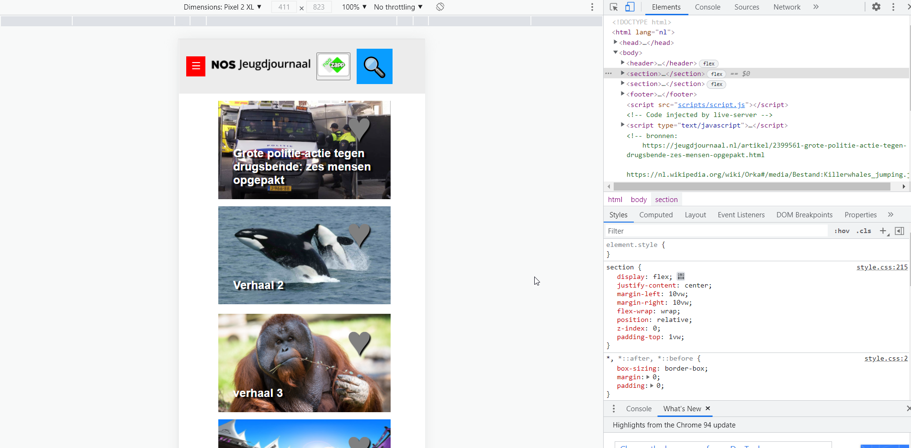
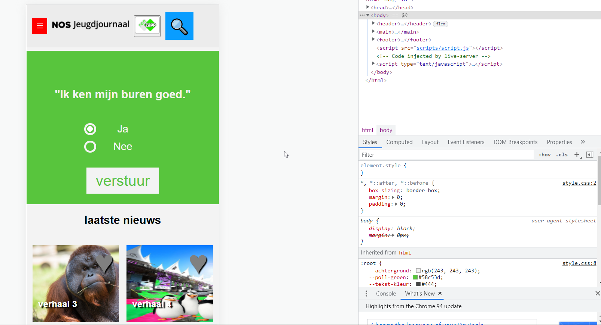
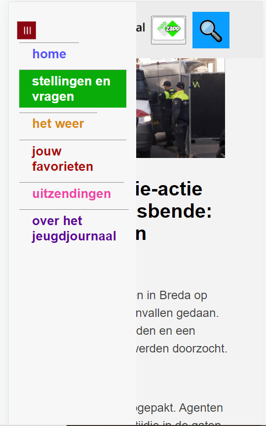
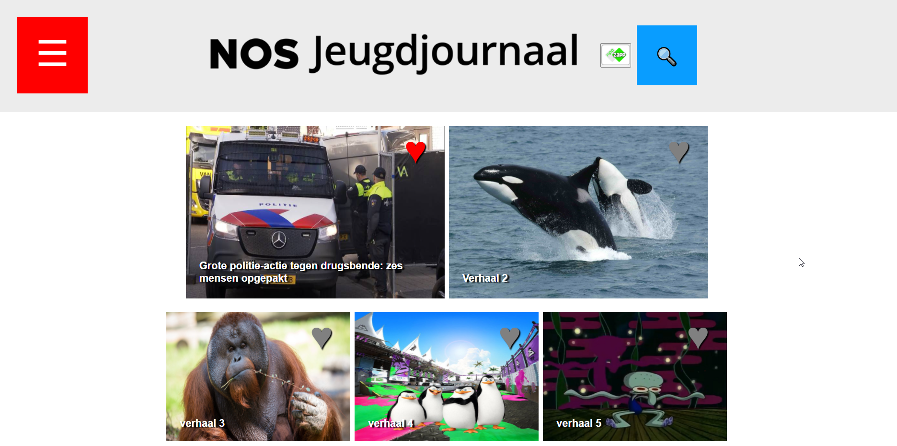
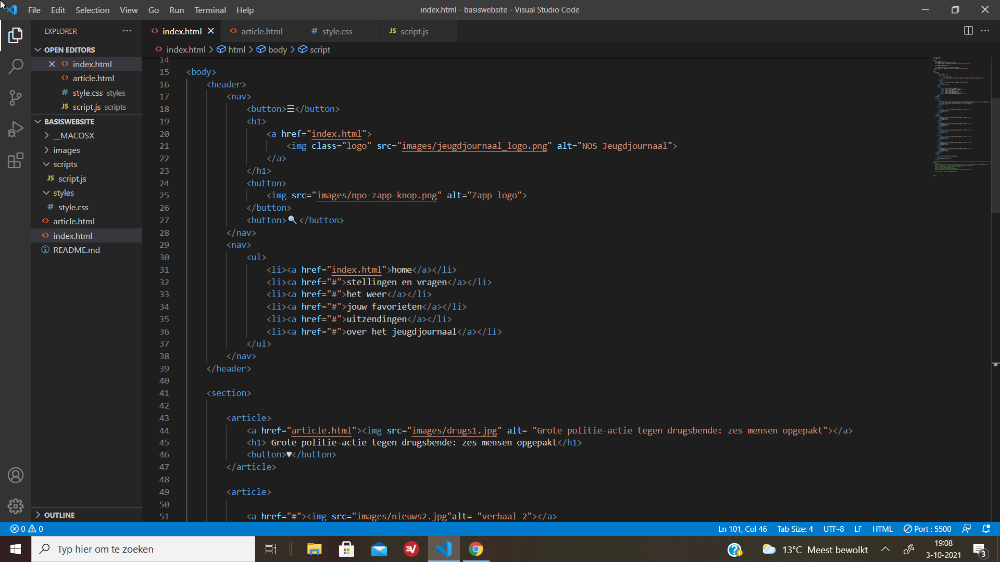
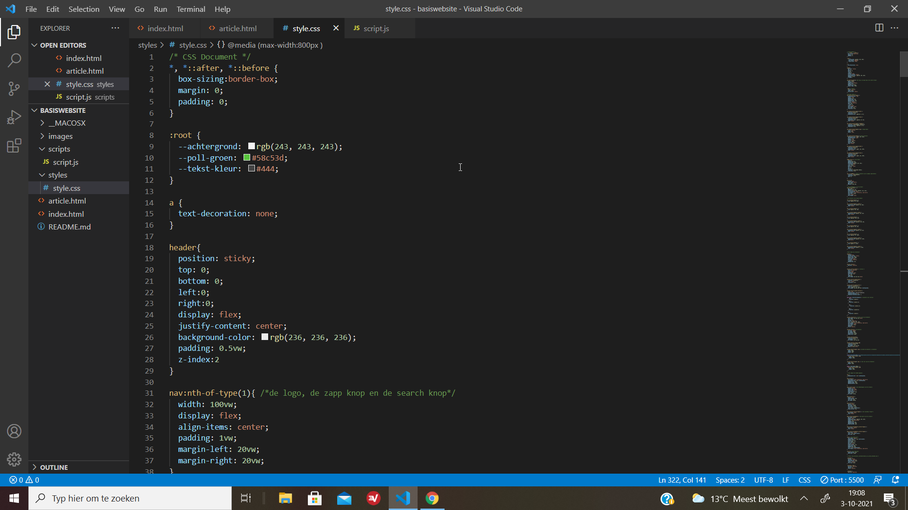
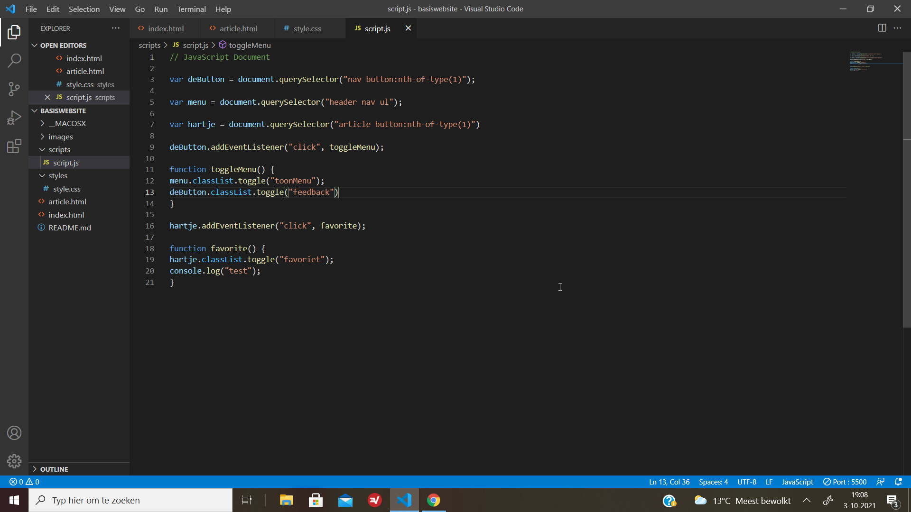
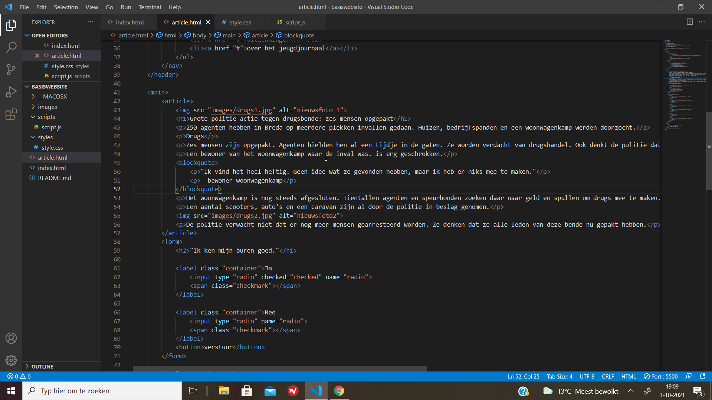

## Bronnenlijst

continu bijhouden terwijl je werkt

Nb. Wees specifiek ('css-tricks' als bron is bijv. niet specifiek genoeg).

1. de form heb ik gemaakt met behulp van https://www.w3schools.com/howto/howto_css_custom_checkbox.asp

2. afbeeldingen: 

	https://jeugdjournaal.nl/artikel/2399561-grote-politie-actie-tegen-drugsbende-zes-mensen-opgepakt.html 
	https://nl.wikipedia.org/wiki/Orka#/media/Bestand:Killerwhales_jumping.jpg
	https://www.houstonzoo.org/explore/animals/orangutan/
	https://i.redd.it/38blr5nte4161.jpg
	https://www.youtube.com/watch?v=Z46tiqzT_9U
	https://www.reddit.com/r/Pepsi/comments/fv76ua/the_pepsi_throne_caw_caw/

	Logo's komen uit https://jeugdjournaal.nl/

